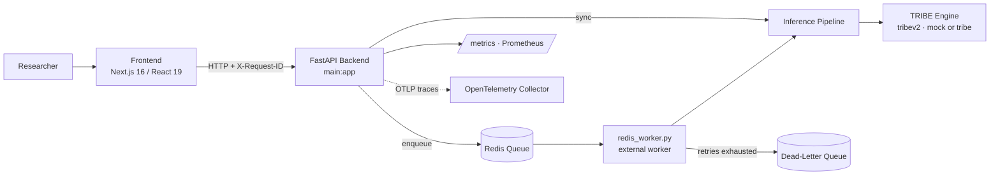

<div align="center">


# Magic Play Place

### Research-Grade Neuro-AI Lab

*A platform for predicting neural-response patterns from multimodal inputs — and for refusing to say more than the evidence allows.*


</div>

---

The brain is about as close to pure chaos as anything you will ever try to model. It is the most complicated structure we know of in the universe, and it does not hand its secrets over cheaply. You point four different kinds of stimulus at it — a sentence, an image, a video, a sound — and something unfathomably complex reorganizes itself in response. That is the domain. That is the chaos.

And what do you do in the face of something like that? You have two options, roughly speaking. You can pretend you understand it — dress up a guess as a discovery and sell it — and that is a kind of lie, and lies about the brain are not trivial lies, because people build their hopes on them. Or you can do the harder thing. You can walk out to the very edge of what is actually known, plant a flag there that says *this far, and no further, not yet*, and then take one careful, honest, documented step into the unknown.

That second thing is what this platform is for. **Magic Play Place is where you stand at the border of what is known and what is not** — and it is built, from the request ID up, so that you cannot cross that border by accident, and cannot cross it dishonestly.

> Every claim this system makes carries a tag that says how much you are actually allowed to believe it. That is not a feature. That is the whole moral point.

It is a **research platform first**. Anything commercializable is built on top of validated research workflows, and never the other way around. The claims in the UI and the API must always match the evidence. Scientific validity and traceability are the primary quality gates — not latency, not throughput, not how impressive the demo looks.

---

## Table of Contents

- [What This Is](#what-this-is)
- [Who It Is For](#who-it-is-for)
- [The Governing Principle](#the-governing-principle)
- [Architecture](#architecture)
- [Quick Start](#quick-start)
- [The API](#the-api)
- [Evidence Tags: The Refusal to Overclaim](#evidence-tags-the-refusal-to-overclaim)
- [Validation Gates: Earning the Right to `model_loop`](#validation-gates-earning-the-right-to-model_loop)
- [Configuration](#configuration)
- [Observability: Keeping the Record](#observability-keeping-the-record)
- [Hardening](#hardening)
- [The Non-Clinical Boundary](#the-non-clinical-boundary)
- [Repository Layout](#repository-layout)
- [Governance Documents](#governance-documents)
- [Testing](#testing)
- [A Closing Word](#a-closing-word)

---

## What This Is

Magic Play Place is a neuroscience research platform. Concretely, it does two things, and it is very careful about the difference between them.

1. **Multimodal discovery (`/predict`).** You submit a stimulus — text, image, video, or audio — and it returns structured insights about the predicted neural response, each carrying an explicit evidence tag and a non-clinical disclaimer, backed by the TRIBE inference engine.
2. **Intervention simulation (`/generate`).** You describe a target affective state and receive a generated therapeutic-research payload. By default this runs in **simulation** mode. A more powerful, validation-gated **`model_loop`** mode exists — and it will not turn on until the evidence says it has earned the right to.

Real inference is provided by the **TRIBE** engine (`tribev2`). Set `INFERENCE_MODE=mock` to develop against deterministic stand-in outputs, or `INFERENCE_MODE=tribe` to run the real model. Underneath both endpoints is a FastAPI backend, a Next.js frontend that tells you the truth about the system's own state, and an operational spine — queues, workers, metrics, traces — sturdy enough that you can run experiments on it instead of babysitting it.

## Who It Is For

- **Neuroscience researchers** who need to run real multimodal experiments and need the outputs to be traceable and honestly labelled.
- **Digital-therapeutics R&D teams** exploring intervention hypotheses *before* any clinical pathway exists — and who understand that "before" is a load-bearing word.
- **Innovation labs** that need reliable experimentation infrastructure: the kind that keeps a record when things go wrong instead of quietly swallowing the failure.

If you are looking for something that will diagnose or treat a patient, this is not that, and it will keep telling you it is not that. That honesty is not a limitation bolted on at the end. It is the point.

## The Governing Principle

There is exactly one rule that everything else in this codebase serves:

> A claim in the UI or the API must always match the evidence level behind it. Scientific validity and traceability are the primary quality gates. Everything commercializable is built on top of validated research — never in front of it.

Read that twice. Every design decision below — the evidence tags, the simulation default, the three validation gates, the request IDs, the dead-letter queue — is a mechanical consequence of taking that one sentence seriously. Build the structure the other way around, with the product in front of the research, and the whole thing is a lie waiting to fall on someone.

---

## Architecture

A system is, in one sense, just an argument about how to impose order on a problem. Notice what the boxes are *for*. The frontend does not decide what is true; it faithfully surfaces what the backend reports, diagnostics and all. The worker does not silently swallow a failure; it records it. The generation endpoint does not reach for its most powerful mode; it defaults to the humble one. Each component is arranged so the truth has somewhere to go and nowhere to hide.



| Layer | Technology | Responsibility |
|---|---|---|
| **Backend** | FastAPI, Python | Serves `/predict`, `/generate`, async jobs, metrics, and health. Stamps every response with `X-Request-ID`. |
| **Engine** | TRIBE (`tribev2`), installed from `engine/tribev2` | Real neural-response inference. Toggled by `INFERENCE_MODE` (`mock` \| `tribe`). |
| **Frontend** | Next.js 16, React 19, TypeScript, Tailwind CSS 4, framer-motion, lucide-react | Surfaces backend health, active inference mode, and actionable diagnostics. Built with Next.js standalone output. |
| **Queue & workers** | Redis as durable queue backend, plus an external worker process (`redis_worker.py`) | Async job processing, retries, and dead-lettering that survive the process that received the work. |
| **Packaging** | Docker + docker-compose, Kubernetes | Baseline manifest with liveness/readiness probes and resource limits, plus worker HPA autoscaling. |
| **Observability** | Prometheus, OpenTelemetry | Runtime + queue metrics and distributed trace export. |

The `mock`/`tribe` switch is worth a moment. It is an admission, made honestly, that a mock is not the real thing — and that the system should never let you forget which one is running. Every response reports its own `inference_mode`. You are never left guessing whether you are looking at the world or at a rehearsal of it.

---

## Quick Start

Enough philosophy. You cannot build order out of chaos from an armchair. Do this in order; it will run.

### Backend

```bash
cd backend
python -m venv .venv
. .venv/Scripts/activate            # Windows PowerShell: .\.venv\Scripts\Activate.ps1
pip install -r requirements.txt
pip install -e ../engine/tribev2    # installs the TRIBE engine (tribev2)
cp .env.example .env
uvicorn main:app --host 0.0.0.0 --port 8000 --reload
# health check:
curl http://localhost:8000/health
```

### Frontend

```bash
cd frontend
npm install
# Optional: create .env.local when overriding the default http://localhost:8000 backend.
npm run dev                         # http://localhost:3000
```

### Docker — both services, plus Redis and the worker

```bash
cd deploy
cp .env.example .env                # replace every CHANGE_ME secret before you do anything else
docker compose up --build
```

> Do not ship placeholder secrets. A `CHANGE_ME` left in production is not an oversight; it is a promise you decided not to keep. Change them.

### Kubernetes

```bash
kubectl apply -f deploy/k8s/magic-play-place.yaml       # baseline: probes + resource limits
kubectl apply -f deploy/k8s/backend-worker-hpa.yaml     # worker horizontal autoscaling
```

---

## The API

Every endpoint here is, in its way, a small act of standing at the edge of what is known and reaching one step past it — carefully, and while keeping the receipt.

Every response carries an `X-Request-ID` header, and every log line is traceable to it. That means when something happens — and something always eventually happens — you can find out exactly what happened, to exactly which request. A thing you cannot trace is a thing you cannot be responsible for.

| Method | Path | Purpose |
|---|---|---|
| `POST` | `/predict` | Multimodal discovery. Submit a stimulus; get structured, evidence-tagged insights and a non-clinical disclaimer. |
| `POST` | `/generate` | Intervention / therapeutic payload generation. Defaults to **simulation** mode. |
| `POST` | `/predict/jobs` | Queue an async prediction. Returns a `job_id` and a `poll_url`. |
| `POST` | `/generate/jobs` | Queue an async generation. Same contract. |
| `GET` | `/jobs/{job_id}` | Poll a queued job's status and, when it is done, its result. |
| `GET` | `/jobs/dead-letter` | Inspect jobs that failed after retries were exhausted. |
| `POST` | `/jobs/{job_id}/retry` | Manually replay a failed job. |
| `GET` | `/metrics` | Prometheus-format runtime + queue metrics. |
| `GET` | `/health` | Liveness check for load balancers and orchestrators. |

### `POST /predict`

Send a stimulus as multipart form data. `media` is an optional upload; `text_prompt`, `profile`, and `age` are form fields.

```bash
curl -X POST http://localhost:8000/predict \
  -F "text_prompt=A calm forest at dawn." \
  -F "profile=neurotypical" \
  -F "age=adult" \
  -i   # note the X-Request-ID header on the way back
```

```jsonc
{
  "status": "success",
  "stimulus_type": "TEXT",
  "insights": { /* structured response prediction */ },
  "inference_mode": "mock",
  "evidence_tags": ["observed", "inferred", "hypothesis"],
  "scientific_disclaimer": "Non-clinical research output. Not for diagnostic or therapeutic use."
}
// A "low_confidence" tag is added when a result is weakly supported.
```

### `POST /generate`

Send a target affective state as JSON. `valence` and `arousal` are integers in `[0, 100]`.

```bash
curl -X POST http://localhost:8000/generate \
  -H "Content-Type: application/json" \
  -d '{"valence": 70, "arousal": 30, "modality": "audio", "profile": "neurotypical", "age": "adult"}'
```

The response reports its own `generation_mode` (`simulation` or `model_loop`) and its `loop_type`, and — this is the honest part — carries the disclaimer and, when relevant, the references to the validation and sign-off reports that authorised the mode it ran in. The caller is never left guessing whether the numbers came from a real model loop or a simulated one.

### Async jobs

For longer work, submit and poll:

```bash
# 1. Submit
curl -X POST http://localhost:8000/predict/jobs -F "text_prompt=..."
# -> {"job_id": "<id>", "state": "queued", "poll_url": "/jobs/<id>", ...}

# 2. Poll
curl http://localhost:8000/jobs/<job_id>
# -> {"state": "succeeded", "result": { ... }, "attempts": 1, ...}
```

The dead-letter pair deserves a moment, because it is easy to walk past and it is the part I would want you to understand.

> When a job exhausts its retries, this system does not drop it into the void. It sets the job down, deliberately, in a place where a person can look at it — inspect it by ID, understand what broke, and choose to replay it. Keeping the record of a failure instead of hiding it is what separates a system you can improve from one you can only be surprised by.

The system that hides its failures is lying to you, quietly, by omission. This one hands them back to you, individually, by ID. And `retry` says something too: that a failure is not necessarily final, that you are allowed to try again — but deliberately, on the record, not by sweeping it back into the pile and hoping.

---

## Evidence Tags: The Refusal to Overclaim

This is the moral heart of the whole thing. If you read one section, read this one.

There is a great deal of difference between saying *this is what happened*, *this is what we can reasonably infer from what happened*, and *this is what we suspect might be true, if we are brave and lucky*. Roughly speaking, most of the trouble in the world comes from collapsing those three sentences into one. This platform refuses to collapse them. When it returns an insight, it does not just hand you a claim — it hands you the claim *and how much you are entitled to believe it*.

| Tag | What it honestly means | What you are permitted to do with it |
|---|---|---|
| `observed` | A direct measured value from the runtime output — tensor statistics, segment counts, timings. This actually happened. | Trust it as a measurement of the model's behaviour. |
| `inferred` | A deterministic interpretation derived from observed metrics through documented heuristics. | Trust the reasoning as far as the heuristic is sound — and the heuristic is written down. |
| `hypothesis` | A speculative research direction, an unvalidated mechanism, a proposed next experiment. | Treat it as a question worth asking, not as an answer. |
| `low_confidence` | A result the system judges weakly supported. | Take it lightly. When the system is unsure, it says so. |

Alongside the tags, every user-visible result carries a `scientific_disclaimer` and the traceable request identifier. Three things, always together: what we claim, how strongly, and how to trace it back.

Calling a hypothesis a hypothesis is one of the quietly courageous things a researcher does. It costs you the thrill of the bigger claim. And a system that presents a hypothesis in the same voice it uses for an observation is, functionally, lying — and the person most easily deceived by that lie is the researcher who built it. To move that boundary by mislabelling is to shift the border of knowledge itself, and everyone downstream then builds on ground that isn't there. So the platform will not let you do it silently. That is the design. That is the promise.

---

## Validation Gates: Earning the Right to `model_loop`

The `/generate` endpoint can do something genuinely powerful. In `model_loop` mode it takes a target state, generates candidate interventions, and scores those candidates against model output, iterating toward the target. That is a real closed loop — and a stronger claim about what the software can do demands a heavier burden of proof.

So it stays locked. It stays locked until it has walked through three gates, in order, leaving an artifact at each one.

| Gate | What it establishes |
|---|---|
| **Gate 1 — Offline replay baseline** | Reproducible behaviour validated against a fixed replay dataset. Does it hold up against known inputs? |
| **Gate 2 — Prospective pilot** | Exercised prospectively across both the synchronous and asynchronous paths. Does it hold up in the real flow, not just the bench? |
| **Gate 3 — Promotion sign-off** | A sign-off artifact generated *from* the Gate 1 and Gate 2 evidence. Someone reads it and takes responsibility for the promotion. |

Only when that chain is complete can `model_loop` run — and it will not take your word for it. The runtime refuses to start unless **all** of the following are set, together:

```env
GENERATE_MODE=model_loop
GENERATE_MODEL_LOOP_VALIDATED=true
GENERATE_MODEL_LOOP_VALIDATION_REPORT=<reference to the validation report>
GENERATE_MODEL_LOOP_SIGNED_OFF=true
GENERATE_MODEL_LOOP_SIGNOFF_REPORT=<reference to the sign-off report>
```

Set `GENERATE_MODEL_LOOP_VALIDATED=true` without pointing at a real validation report and the process will not boot. Claim it is signed off without the sign-off artifact and it will not boot. You cannot flip the switch and skip the road. The road *is* the switch.

> A validation gate is not bureaucracy. It is a promise you make to your future self — that you will not hand power to the system until the system has demonstrated it can be trusted with it. That is what it means to bear the weight of the work properly.

And note the line that does not move: even when `model_loop` is fully promoted and signed off, **the output remains non-clinical research output.** Passing the gates makes the capability trustworthy as *research*. Earning a better mode does not earn a bigger claim. That line is not for sale. The full plan lives at [`docs/GENERATE_MODEL_LOOP_VALIDATION_PLAN.md`](docs/GENERATE_MODEL_LOOP_VALIDATION_PLAN.md); read it before you promote anything.

---

## Configuration

The backend is configured through environment variables; start from `backend/.env.example`. The ones that carry real weight:

| Variable | Default | What it governs |
|---|---|---|
| `INFERENCE_MODE` | `mock` | `mock` (deterministic stand-in) or `tribe` (real TRIBE inference). |
| `TRIBEV2_CHECKPOINT_DIR` | *(empty)* | Checkpoint dir / repo id. Required when `INFERENCE_MODE=tribe`. |
| `GENERATE_MODE` | `simulation` | `simulation`, or `model_loop` — which demands the full gate set above. |
| `QUEUE_BACKEND` | `inmemory` | `inmemory`, or `redis` for durable queued jobs. |
| `REDIS_URL` | `redis://localhost:6379/0` | Where the durable queue lives. |
| `ASYNC_JOB_QUEUE_ENABLED` | `true` | Whether the async job endpoints accept work. |
| `JOB_WORKER_CONCURRENCY` | `2` | Concurrent jobs per worker. |
| `JOB_MAX_RETRIES` | `2` | Attempts before a job is dead-lettered. |
| `REQUIRE_API_KEY` / `API_KEY` | `false` / *(empty)* | Optional API-key auth. If required, the service refuses to start without a key. |
| `RATE_LIMIT_ENABLED` | `true` | Route-scoped, in-memory rate limiting. |
| `MAX_UPLOAD_MB` | `50` | Upload size ceiling. |
| `UPLOAD_TTL_HOURS` | `24` | Retention window for uploaded/generated artifacts. |
| `DELETE_UPLOADS_AFTER_INFERENCE` | `false` | Delete request artifacts once inference completes. |
| `METRICS_ENABLED` | `true` | Exposes `/metrics`. |
| `OTEL_ENABLED` / `OTEL_EXPORTER_OTLP_ENDPOINT` | `false` / `http://localhost:4318/v1/traces` | OpenTelemetry trace export — turn on only when a collector exists. |

On the frontend, remember that `NEXT_PUBLIC_*` values are build-time in Next.js. Set `NEXT_PUBLIC_API_BASE_URL` (and `NEXT_PUBLIC_API_KEY`, if backend auth is on) in `frontend/.env.local` *before* you build the image, or the client bundle will ship the wrong endpoint. See [`DEPLOYMENT.md`](DEPLOYMENT.md) for the full production posture.

---

## Observability: Keeping the Record

You cannot take responsibility for what you cannot see, so the system is built to be seen.

- **`X-Request-ID` on every response**, supplied by the caller or minted on arrival, threaded into every log line. This is the atomic unit of accountability here.
- **`GET /metrics`** in Prometheus format — runtime and queue metrics, ready to scrape.
- **OpenTelemetry trace export** (`OTEL_ENABLED=true`), so a single request's journey through the system is a thing you can actually follow.
- **The dead-letter queue and manual retry**, which turn silent failure into a visible, addressable record.

None of this is glamorous. But it is the machinery of honesty: it is how the system tells the truth about itself, continuously, whether or not anyone is watching.

---

## Hardening

The border of the known is not a safe neighbourhood. The platform is built to hold its ground.

- **Optional API-key authentication** (`REQUIRE_API_KEY`), with the service refusing to start misconfigured.
- **Route-scoped, in-memory rate limiting** to keep any one caller from crowding out the rest — a boundary you set on yourself before the world sets a worse one on you.
- **Layered media validation** — every upload is checked by file extension, then MIME type, then binary signature, before a single byte reaches inference. A file that lies about what it is does not get through.
- **Upload artifact lifecycle** — TTL-based cleanup, with an optional delete-after-inference mode for sensitive workflows. You keep what you need and no more.

---

## The Non-Clinical Boundary

Let me be as plain about this as I can, because the whole edifice depends on it.

**This is not a medical device. It is not a diagnostic service. It is not a clinical intervention platform.** Outputs from `/predict`, `/generate`, and the async endpoints are research-use only. No API or UI output may be framed as treatment advice or patient-specific guidance. Any therapeutic framing stays simulation-only unless a validated model-loop is explicitly enabled and documented — and even then, the output is still research output.

Words like *simulated*, *research-use*, *prototype*, *hypothesis-generating*, *model output* — those are allowed. Words like *diagnoses*, *treats*, *prevents*, *clinically proven*, *patient-safe* — those are not, and will not be, without a separate regulatory, ethics, and clinical-validation pathway that lives entirely outside this repository. This is not legal throat-clearing. It is the evidence-tag principle scaled up to the whole project: do not claim more than you have earned the right to claim.

---

## Repository Layout

```
magic-play-place/
├── backend/                 FastAPI service (routes, inference, jobs, media, metrics, auth, redis_worker.py)
├── frontend/                Next.js 16 / React 19 app (standalone output)
├── engine/tribev2/          TRIBE inference engine (installed with pip install -e)
├── deploy/
│   ├── docker-compose.yml   both services + Redis + worker
│   └── k8s/
│       ├── magic-play-place.yaml      baseline manifest (probes + resource limits)
│       └── backend-worker-hpa.yaml    worker horizontal pod autoscaler
├── frontend/
│   ├── public/magic-play-place-logo.png   transparent UI and documentation logo
│   └── src/app/favicon.ico                 transparent multi-size browser icon
├── docs/
│   ├── RESEARCH_USE_AND_EVIDENCE_POLICY.md
│   ├── GENERATE_MODEL_LOOP_VALIDATION_PLAN.md
│   └── reports/             Gate 1 / Gate 2 / Gate 3 artifacts
├── ROADMAP.md
└── DEPLOYMENT.md
```

---

## Governance Documents

These are not afterthoughts. They are where the discipline is written down so it does not depend on anyone remembering to be careful.

- **[`docs/RESEARCH_USE_AND_EVIDENCE_POLICY.md`](docs/RESEARCH_USE_AND_EVIDENCE_POLICY.md)** — how claims are governed against evidence, and why nothing here is clinical.
- **[`docs/GENERATE_MODEL_LOOP_VALIDATION_PLAN.md`](docs/GENERATE_MODEL_LOOP_VALIDATION_PLAN.md)** — the full plan behind the three gates.
- **[`docs/reports/`](docs/reports/)** — the generated Gate 1, Gate 2, and Gate 3 artifacts themselves.
- **[`ROADMAP.md`](ROADMAP.md)** and **[`DEPLOYMENT.md`](DEPLOYMENT.md)** — where it is going, and how to stand it up.

---

## Testing

You test the thing because you want to know whether it works, not to feel as though it works. Those are different, and the difference is everything.

```bash
# backend
cd backend
python -m unittest discover -s tests -p "test_*.py"

# frontend
cd frontend
npm test
```

---

## A Closing Word

So here is what you are actually holding. Not a machine that understands the brain — no one has that, and anyone who tells you they do is selling something. What you are holding is a *discipline*, expressed in code: a way of walking up to the edge of the enormous, chaotic thing we do not understand, taking one honest step into it, and labelling that step truthfully so the next person can trust where they are standing.

The evidence tag, the disclaimer, the request ID, the dead-letter queue, the three gates that will not let you lie your way past them — these are not the boring parts you tolerate on the way to the interesting parts. They *are* the interesting part. They are what it looks like to take the unknown seriously and to refuse to pretend. Build software that lets you say whatever you wish were true and it will feel like progress for a little while, but research done that way rots — quietly, and then all at once — and that is a terrible thing, in the deepest sense, because someone downstream leans their weight on what you wrote down.

Aim up. Tell the truth — especially to yourself, and especially in the results. Bear the weight of research done honestly, and build on validated ground, one traceable step at a time, so the map you draw of that dark and complicated territory is a map someone can actually follow.

> That is the work. Now go sort out your experiment — and aim up.
